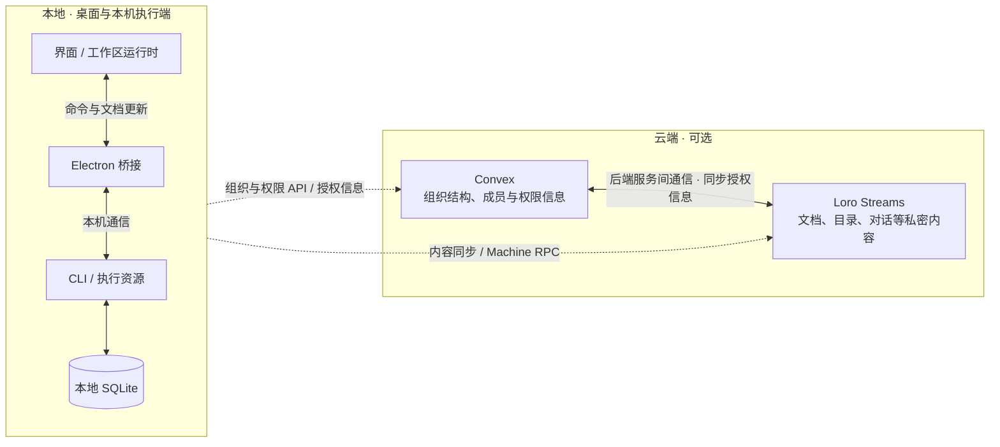

# 通讯架构

Status: draft  
Human review: pending  
Translation: pending

本文描述本地与云端的通讯分工。客户端路径依据本仓库代码，云端数据归属与授权同步依据维护者确认的架构意图；后端实现与端到端行为尚未核实，全文仍待人工 review。

## 我们希望读者理解什么

用户在桌面发起工作，由目标机器上的 CLI 执行。界面与 CLI 既要交换立即处理的命令，也要同步可以恢复的工作区和会话数据。这两种通信不能互相代替：收到命令回复，不代表所有共享数据已经同步完成。

公开桌面默认使用本地模式，无需产品云服务。源码另有可选云适配接口；接入云服务的产品可以复用共享 UI 和执行逻辑。

## 模块与路径

左侧是本地运行与存储，右侧是可选云端。虚线表示本地客户端与云端的通信；云端内部的箭头表示服务间授权同步，省略具体协议。

| 部分 | 负责什么 |
| --- | --- |
| 界面与工作区运行时 | 展示文档副本，判断目标机器归属，选择对应通信路径 |
| Electron 桥接 | 转发本地控制请求及文档消息，连接界面与本机 CLI |
| CLI | 持有本机执行资源，处理命令，保存并同步工作区与会话数据 |
| Convex | 保存组织结构、成员关系和权限信息，提供相应的平台 API |
| Loro Streams | 承载文档、整个目录、对话等私密或偏敏感内容的存储与同步，也承载独立的 Machine RPC 请求与响应流 |

**两者的关系。** Convex 管理谁属于哪个组织、谁可以访问什么；Loro Streams 承载这些权限所保护的内容。授权信息通过两者的后端服务间通信同步，使内容访问遵循组织与权限设置。图中的双向箭头表达服务间协作，不表示两边都可以独立修改权限，也不指定同步时序。

Loro/Flock 定义可合并的数据，loro-repo 管理文档集合、存储与传输；Loro Streams 是传输服务，不决定产品字段的含义。Convex 的订阅和 Machine RPC 都不是 CRDT 文档同步的替代品。

## 两条典型路径

**操作本机。** 界面经 Electron 向 CLI 发送本地控制请求；文档更新通过本地数据通道交换，CLI 使用 SQLite 持久化。已经确定属于本机的操作不等待云令牌，也不在本地桥接失败后改投远程 RPC。

**可选云协作。** 客户端通过云适配取得工作区访问和授权信息；组织与权限由 Convex 管理，文档、目录和对话内容通过 Loro Streams 存储与同步。两者在后端同步授权信息。请求目标机器执行操作时，则进入该机器的 RPC 请求流，CLI 执行后向请求指定的响应流回复。内容同步与 RPC 共享传输服务，但具有不同的数据和完成语义。

云组装也可以同时接入本地与远程通道；路由按目标归属选择。公共本地组装不会因为源码包含云适配就自动开启它。公开运行时制品下载是既有边界允许的例外，不代表产品云能力可用。

## 失败与已有约束

本地已保存、远端已收到、目标执行完成应分别表达。尤其工作区目录写入不能因为后续上传失败而被报告为保存失败。连接成功也不能作为所有文档已经就绪的证明。

约束仍由现有文件维护：[根 AGENTS](../AGENTS.md) 管理平台边界与目录持久化，[组件 AGENTS](../packages/components/AGENTS.md) 管理目标路由，[RPC AGENTS](../packages/loro-streams-rpc/AGENTS.md) 管理请求响应。本草稿不另建 invariants 清单。

## 请人工 review

- 上述分工是否准确表达产品意图？哪些职责边界需要进一步明确？
- 权限变更和撤销如何生效、同步失败如何处理，是否需要后续单独说明？本篇先保留服务职责层次，不预设具体时序保证。
- 附件、终端和预览有各自通道，本篇暂不展开；哪些值得作为下一篇说明？

## 实现核对入口

以下链接是导航，未绑定自动新鲜度检查。此次仅静态阅读，未执行运行验证。

- [平台及同步模式](../packages/platform/src/provider.ts)、[本地组装](../packages/platform/src/local.ts)
- [工作区路由与传输](../packages/components/src/providers/create-workspace-runtime.ts)、[Electron 文档转发](../apps/electron/src/main/services/loro-data-plane-relay.ts)
- [CLI 本地存储与可选远程同步](../apps/cli/src/lib/loro/doc.ts)
- [CLI 云适配](../apps/cli/src/lib/cloud-cli-port.ts)、[界面 Convex 适配](../packages/components/src/providers/cloud-platform-api.ts)
- [CLI RPC 接线](../apps/cli/src/lib/message-handler.ts)、[请求分发](../packages/loro-streams-rpc/src/machine-rpc-server.ts)
